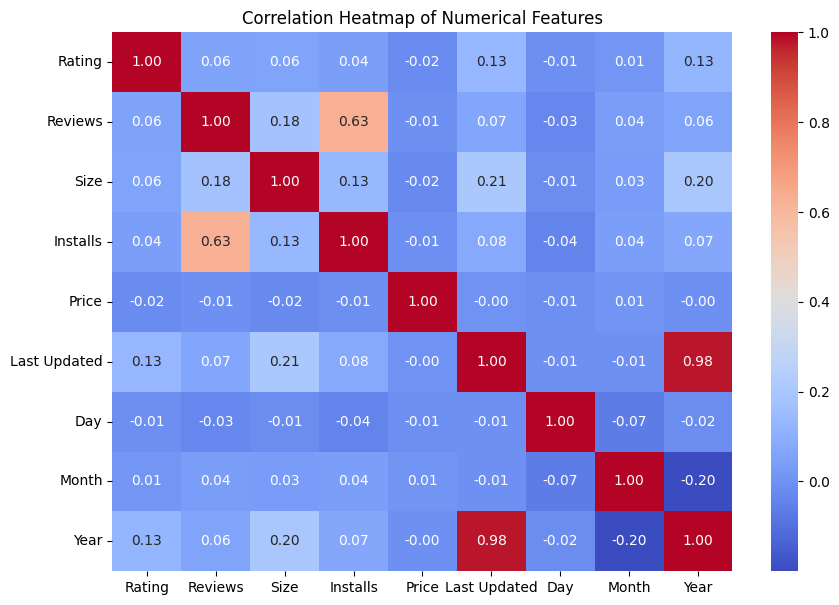
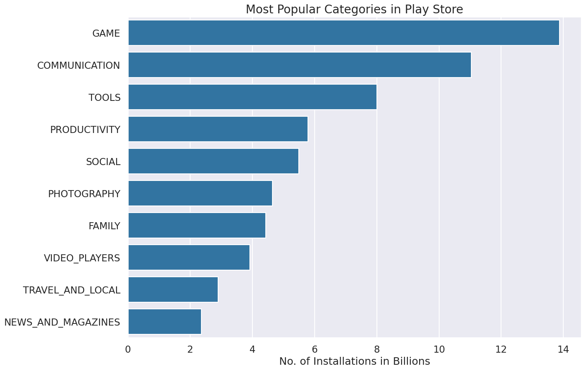
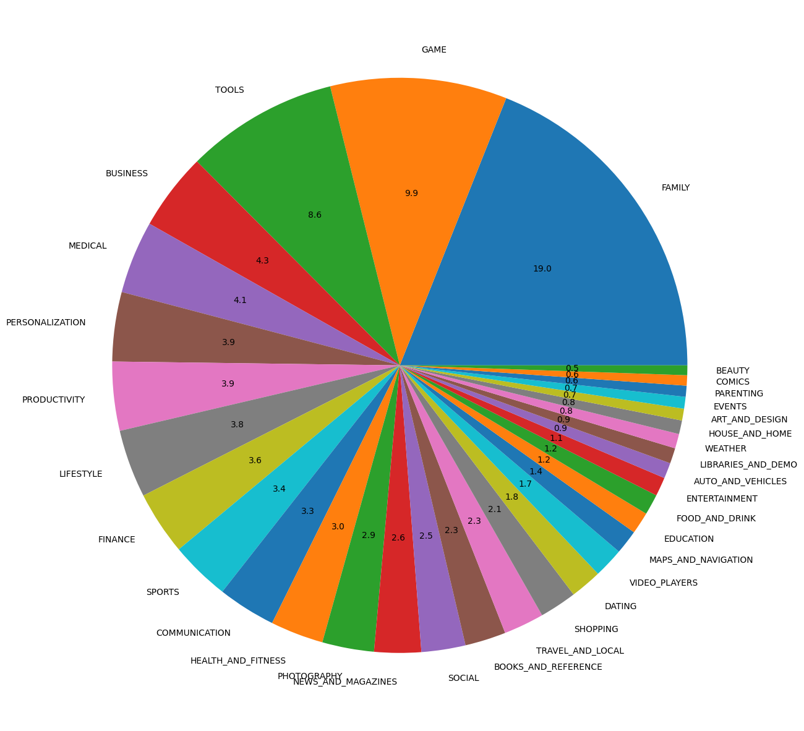

# Google Play Store — EDA & Feature Engineering

A Python exploratory data analysis project on the Kaggle "Google Play Store Apps" dataset (10,841 scraped app records) — data cleaning, feature engineering, and business-question-driven analysis using Pandas, Matplotlib, and Seaborn. This is the portfolio's dedicated Python/EDA piece, sitting alongside the SQL and BI work as proof of the raw data-wrangling layer before a dashboard ever gets built.

## What This Covers

**Data Cleaning**
- `Reviews`: converted from string to integer (after isolating and dropping one corrupt row that broke the cast)
- `Size`: normalized `M`/`k` suffixes into a consistent numeric scale
- `Installs` and `Price`: stripped `+`, `$`, and `,` characters, cast to proper numeric types
- `Last Updated`: parsed to datetime and broken out into `Day`, `Month`, `Year` features
- Dropped duplicate app entries (kept first occurrence)

**Exploratory Analysis**
- Null-value and dtype audit across all 13 original columns
- Categorical feature proportions (`Category`, `Type`, `Content Rating`, `Genres`)
- Univariate analysis of categorical features (count plots)
- Category distribution (pie chart) and Top 10 App Categories by count
- Correlation heatmap across numerical features (Rating, Reviews, Size, Installs, Price, Last Updated/Year)

**Business Questions (Internal Assignments)**
1. Which categories drive the most installs? (bar chart, installs in billions)
2. Within the top categories (Game, Communication, Productivity, Social), which specific apps lead installs?
3. Third analysis question building on the cleaned install/category data

## Key Insights

- Reviews and Installs are meaningfully correlated (0.63) — more installs generally means more reviews, an expected but confirmed relationship
- **Family** and **Games** are the most common categories by app count, but **Games** leads in total installs
- Subway Surfers, Hangouts, Google Drive, and Instagram top their respective categories by installs
- 271 apps hold a perfect 5.0 rating
- `Last Updated`'s Year component correlates strongly with itself via the derived Day/Month/Year split (0.98) — an expected artifact of the feature engineering, not a real relationship between distinct variables

## Sample Visuals

**Correlation Heatmap**

**Most Popular Categories by Installs**

**Category Distribution**

## Tech Stack

- **Python** — Pandas (cleaning, groupby aggregation), Matplotlib & Seaborn (visualization)
- Jupyter Notebook

## Dataset

[Google Play Store Apps — Kaggle](https://www.kaggle.com/datasets/lava18/google-play-store-apps) (`googleplaystore.csv`, 10,841 rows × 13 columns)
